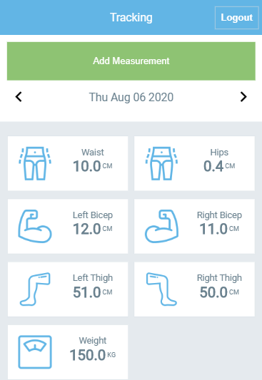
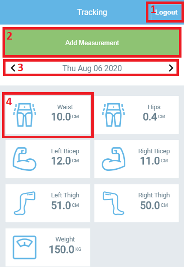

# Tracking Front

Tracking Front is a SPA app that gathers data from [Tracking API](https://github.com/kazumaki/tracking-api)

## Screenshot



## Live Version

[Live Version](http://vinic-tracking-front.herokuapp.com/)

## Getting Started

Clone the repository into your local computer.

```
$ git clone https://github.com/kazumaki/tracking-front.git
```

### Installing

First, you'll have to install the newest version of [Node](https://nodejs.org/en/download/). Otherwise, the npx command might not be available. Then move into the project main directory on the console and follow the instructions below. 

Install all packages:

```
$ npm install
```

Run local webserver

```
$ npm start
```

Now in your browser type the following address and press enter.

```
http://127.0.0.1:5000
```

### Testing

Run test command

```
npm run test
```

### Using the App

The live version already has a test account, just input email: test@mail.com and password: test123. But if you want to create your own just click on Signup and input data requested.

#### Main Page Features
* Logout - 1
* Add Measurement - 2
* Change Measurements Date - 3
* Click To Show Measurements History - 4

 

### Measurement History Features
* Go Back To Main Page - 1
* Delete A Specific Measurement - 2

## App Development

### Done

On the first day, I focused on developing the API calls to get data from [Tracking API](https://github.com/kazumaki/tracking-api) and store it inside the Redux store. On the second day I've focused on set-up a authentication system for my application. On the third day I've developed the basic layout of the application with all basic functionalities. On the fourth and fifth day I've worked on the styling of the application.

After login the application fetches measurements only once from the server and every action after this is done only on the client-side to avoid getting the list of measurements every time from the server, it just checks if the server returns a good response and then modify the redux store.

### Ideas for improvement

* Add edit measurement option
* Create a desktop version
* Display charts to better visualization of data

## Built With

* [JavaScript](https://www.javascript.com/) - Programming language used
* [React](https://reactjs.org/) - Library used for build UI
* [Redux](https://redux.js.org/) - Library used to share state between React components
* [HTML](https://en.wikipedia.org/wiki/HTML) - Hypertext Markup Language
* [VS Code](https://code.visualstudio.com/) - The code editor used

## Assets

* [All graphics assets](https://www.flaticon.com/authors/freepik) - All the assets used in the app
* [Design based](https://www.behance.net/gallery/13271423/Bodytrackit-An-iOs-app-Branding-UX-and-UI) - Based design

## Author

👤 **Vinicius Campos Carvalho**

<a href="https://github.com/kazumaki" rel="noopener noreferrer" target="_blank">